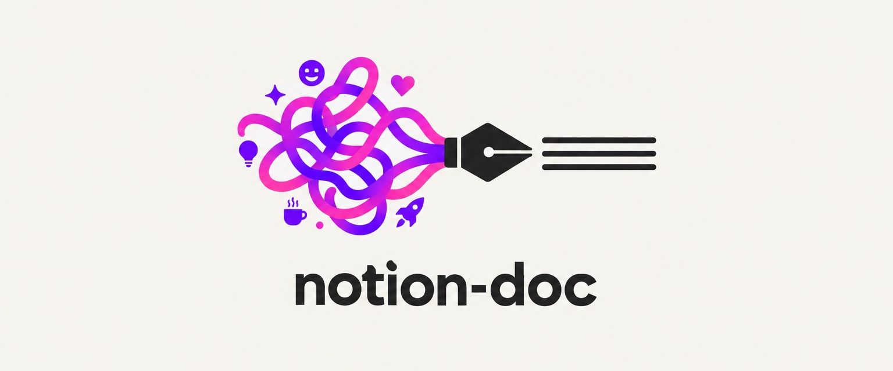

# 📄 notion-doc

> Make your AI agent write documents like Notion — not like an AI.



[](https://github.com/heyman333/agent-notion-template-docs/actions/workflows/notion-sync.yml)

[한국어](README.ko.md)

Ask an AI agent to create a document and you'll often get the same kind of output: a purple gradient hero, emoji-heavy headings, cards with drop shadows.

**notion-doc** is an agent skill that gives those documents a Notion-like visual style.

It doesn't decide what goes into your document or how it's structured. Your agent still handles the content and outline. notion-doc only handles the presentation.

| Without notion-doc | With notion-doc |
| --- | --- |
|  |  |

## What it includes

The skill provides a set of HTML blocks commonly used in Notion:

- Emoji page icons, tag pills, meta lines, and breadcrumbs
- Callouts in 5 colors: blue (key point), gray (note), green (done), yellow (caution), and red (warning)
- Table of contents, simple tables, 2-column layouts, and buttons
- Toggles (`<details>`), checklists with strikethrough, quotes, and bookmark cards
- Syntax-highlighted code blocks using Prism, with light and dark themes
- Inline code
- Notion-style text colors: blue, red, orange, green, and purple
- Korean-aware line breaking (`word-break: keep-all`)
- Print/PDF layout with `@media print`

### One template for the visual style

The agent doesn't generate CSS for each document. It copies
[template.html](skills/notion-doc/template.html) and fills in the content.

The template defines a 720px content width, `#2C2C2B` text color, and Notion's light and dark color palettes as CSS tokens.

Dark mode follows the viewer's theme. When printed or exported to PDF, it switches back to the light palette.

| Light | Dark |
| --- | --- |
|  |  |

## Install

notion-doc ships as a portable [Agent Plugin](https://agent-plugins.org) — one
`plugin.json`, one `skills/` directory, one hook. Codex and Claude Code install
the same files.

### Codex

Install it as a plugin:

```bash
codex plugin marketplace add heyman333/agent-notion-template-docs
```

Then pick `notion-doc` in the plugin browser:

```text
/plugins
```

Or drop the skill in by hand — it is a directory, nothing to build:

```bash
# this repo only
mkdir -p .agents/skills && cp -r skills/notion-doc .agents/skills/

# every project
mkdir -p ~/.agents/skills && cp -r skills/notion-doc ~/.agents/skills/
```

Codex picks it up on the next session. Ask for a document and it applies on its
own; to force it, type `$notion-doc`.

If you install by hand rather than as a plugin, the lint hook does not come
along. Wire it up once in `~/.codex/hooks.json` (or `<repo>/.codex/hooks.json`):

```json
{
  "hooks": {
    "PostToolUse": [
      {
        "matcher": "Write|Edit|apply_patch",
        "hooks": [
          {
            "type": "command",
            "command": "/path/to/agent-notion-template-docs/hooks/notion-doc-lint.py"
          }
        ]
      }
    ]
  }
}
```

The script reads the tool payload on stdin and takes no arguments. It
understands both payload shapes — Claude Code's `file_path` and Codex's
`apply_patch` body.

### Claude Code

```text
/plugin marketplace add heyman333/agent-notion-template-docs
/plugin install notion-doc@agent-notion-template-docs
```

#### Choosing an install scope

By default the plugin is installed at the **user** scope — it applies to all of *your* projects and never touches the repo, so teammates are unaffected.

To narrow or widen that, pass `--scope` on the CLI:

```bash
# just me, just this project (.claude/settings.local.json — auto-gitignored)
claude plugin marketplace add heyman333/agent-notion-template-docs --scope local
claude plugin install notion-doc@agent-notion-template-docs --scope local

# the whole team on this project (.claude/settings.json — commit it)
claude plugin marketplace add heyman333/agent-notion-template-docs --scope project
claude plugin install notion-doc@agent-notion-template-docs --scope project
```

With `project` scope, teammates get an install prompt on their next session after pulling. With `local` scope, nothing you install shows up in git.

#### Updating

New versions ship through this marketplace repo, so refresh the marketplace first, then update the plugin:

```text
/plugin marketplace update agent-notion-template-docs
/plugin update notion-doc@agent-notion-template-docs
```

Or from the CLI, passing the scope you installed at:

```bash
claude plugin marketplace update agent-notion-template-docs
claude plugin update notion-doc@agent-notion-template-docs --scope user   # or local / project
```

Restart Claude Code to apply. If you installed at more than one scope, update each one — in a project the narrower scope wins. `claude plugin list` shows what you currently have.

You can also copy the skill manually.

```bash
# this project only
cp -r skills/notion-doc <your-project>/.claude/skills/

# every project
cp -r skills/notion-doc ~/.claude/skills/
```

### Cursor, Gemini CLI, and others

The skill is two plain files with no agent-specific dependencies. Any agent that can read instruction files can use it.

See [Using with other agents](docs/using-with-other-agents.md) for ready-to-paste snippets for `AGENTS.md`, `.cursor/rules`, and `GEMINI.md`.

## Usage

Once installed, notion-doc is applied automatically when you ask the agent to create a document.

For example:

- "Write this up as a report"
- "Summarize this as a doc"
- "Write a postmortem"

You can also invoke it explicitly:

| Agent | Invoke |
| --- | --- |
| Codex | `$notion-doc` |
| Claude Code | `/notion-doc:notion-doc` |

## Keeping the template intact

The skill is designed around a single HTML template. The agent should use the template rather than creating its own CSS.

`lint.py` checks generated documents against `template.html`:

```bash
python3 skills/notion-doc/lint.py mydoc.html
```

For example:

```text
✗ mydoc.html
  ERROR [css-drift] CSS differs from the canon (1 lines). Do not write new CSS — +    box-shadow: 0 4px 12px ...
  ERROR [unknown-class] Classes not in the template: hero-card. Do not invent classes — pick from the block dictionary
```

The linter catches:

- CSS changes such as new shadows, gradients, or colors
- Inline `style` attributes
- Hand-written colors in the document body
- Classes that are not defined in the template
- Code blocks without a `language-*` class

It uses only the Python standard library, so it can run in any agent or CI environment.

When installed as a plugin, a `PostToolUse` hook runs after HTML files are written and reports what needs to be fixed. If the document was created without the skill, it gives a short reminder to use it. The same script serves both runtimes — it reads Codex's `apply_patch` payload and Claude Code's `file_path` payload.

The hook is limited to document files and skips apps, framework templates, and build output. See the [gating tests](hooks/test_gating.py).

## Examples

Open the HTML files in a browser to see the actual output.

| File | Content | Blocks shown |
| --- | --- | --- |
| [sample.html](examples/sample.html) | Campaign proposal (Korean) | Most of the available blocks: breadcrumb, TOC, 5 callout colors, tables, 2-column layout, toggle, checklist, bookmark, button |
| [sample-tech.html](examples/sample-tech.html) | Incident analysis (Korean) | Syntax-highlighted code, red/yellow callouts |
| [sample-en.html](examples/sample-en.html) | Campaign proposal (English) | Same document as `sample.html`, in English |
| [before.html](examples/before.html) | Without notion-doc | A typical default agent output |

## Repo layout

```text
plugin.json            # portable manifest (Agent Plugins 1.0)
hooks.json             # Codex PostToolUse hook
AGENTS.md              # instructions for agents working on this repo

.codex-plugin/
  plugin.json          # Codex compatibility manifest
.agents/
  plugins/marketplace.json   # Codex marketplace catalog
  skills/notion-doc          # symlink → skills/notion-doc
.claude-plugin/
  plugin.json          # Claude Code manifest
  marketplace.json     # Claude Code marketplace catalog

skills/notion-doc/
  SKILL.md             # block dictionary and visual rules
  template.html        # HTML template and CSS
  lint.py              # checks documents against the template

hooks/
  hooks.json           # Claude Code PostToolUse hook
  notion-doc-lint.py   # the hook itself — reads both payload shapes
  test_gating.py       # tests hook behavior

examples/              # rendered example documents

scripts/               # screenshots, Notion sync, manifest consistency

docs/
  using-with-other-agents.md
```

The skill lives in exactly one place. `.agents/skills/notion-doc` is a symlink,
so Codex and Claude Code can never drift apart.

## Staying in sync with Notion

Notion continues to add new block types and change its visual design. This repo periodically checks a public Notion reference page to see if the implementation has drifted.

The weekly CI job, [notion-sync](.github/workflows/notion-sync.yml), checks the reference page in three ways:

- **Design tokens**: every color in Notion's light and dark palettes, read directly from Notion's own stylesheets (no browser needed).
- **Block types** are read through Notion's page API, with cursor pagination.
- **Render sanity**: a headless browser render confirms the geometry and that blocks still paint.

The results are compared against the committed baselines in [sync/notion-tokens.json](sync/notion-tokens.json) and [sync/notion-snapshot.json](sync/notion-snapshot.json).

Reference page:

[Notion Block Reference — All of Notion's Blocks](https://thomasfrank.notion.site/8b40147600284c60b6f708e38f16ee68)

(Thomas Frank's public reference page.)

When the reference changes, the CI job reports the difference and opens an issue. The report also indicates whether a new block type is already supported by notion-doc.

## Design source

The visual style in `template.html` is based on Notion's own design tokens rather than manually approximated values.

Notion declares its tokens right in its inline styles (`background: var(--c-graBacPri)`), so every value can be traced instead of sampled:

- [scripts/notion_style_probe.py](scripts/notion_style_probe.py) renders the [Notion Block Reference — All of Notion's Blocks](https://thomasfrank.notion.site/8b40147600284c60b6f708e38f16ee68) page headlessly and reads the block→token mapping straight off the DOM.
- [scripts/notion_tokens.py](scripts/notion_tokens.py) extracts each token's exact light *and* dark value from Notion's stylesheets.

The weekly [notion-sync](#staying-in-sync-with-notion) job re-checks all of it, so the template can't silently drift from Notion.

## License

[MIT](LICENSE)
